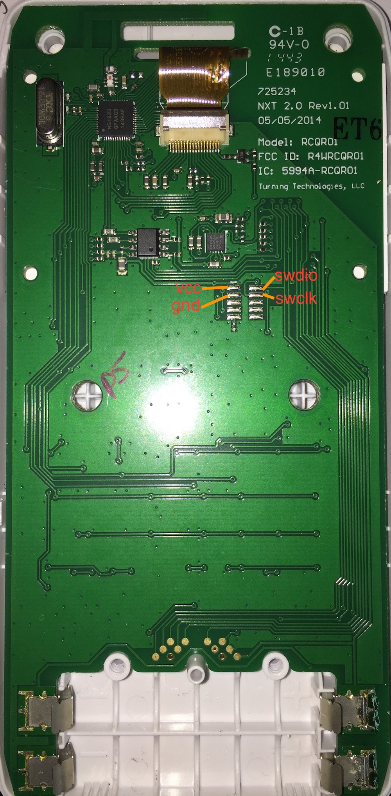

# RCQR-01 demo software
Turning Technologies QT "clicker" (RCQR-01) hardware and software exploration (WIP).
My adventures in reverse engineering an interesting platform.

## hardware
* based on nrf51822 (QFAA, 16kB ram, 256kB flash, Cortex M0)
* low ram (non 32k model) makes it very tricky to run any BLE softdevice.

### Display
 * lcd 360x160 ?, 2-bit grayscale ?
 * maybe ST7586 chipset? connected to serial bus. Use SPI to transfer data to chip.
 * hacked up uGFX framework
 * extremely wierd pixel column format (packed 3 2-bit pixels per byte)
 * no per-pixel modification, so using a 1bpp framebuffer (consumes considerable amount of ram) and just flushing periodically to display chip
   * may be able to optimize this down to a smaller row buffer, and for pixel-level or window modifications, just read and rewrite and "dirty" display lines
 * Microchip MCP1256 3.3v boost converter/regulator powers lcd stuff
 
### eeprom
 * CAT25512 512-Kb SPI Serial CMOS EEPROM
 
### keyboard
 * 8x8 matrix, qwerty style. Glow-in-the-dark keypad is a neat touch.
 * rows have external pullups?
 
### pinout

| nRF51822 gpio | component     | | nRF51822 gpio | component     |
|---------------|---------------|-|---------------|---------------|
| 00            | EEP_CK        | | 16            | EEP_SO        |
| 01            | LCD_CS        | | 17            | KEY_COL3      |
| 02            | LCD_RST       | | 18            | KEY_ROW1      |
| 03            | LCD_DC        | | 19            | KEY_ROW2      |
| 04            | LCD_MISO      | | 20            | KEY_ROW3      |
| 05            | LCD_MOSI      | | 21            | KEY_ROW4      |
| 06            | LCD_RW        | | 22            | KEY_ROW5      |
| 07            | LCD_SCK       | | 23            | KEY_ROW6      |
| 08            | KEY_ROW0      | | 24            | KEY_ROW7      |
| 09            | KEY_COL0      | | 25            | KEY_COL4      |
| 10            | KEY_COL1      | | 26            | KEY_COL5      |
| 11            | KEY_COL2      | | 27            | MCP1256_SHDN  |
| 12            | EEP_CS        | | 28            | KEY_COL6      |
| 13            | LCD_BACKLIGHT | | 29            | KEY_COL7      |
| 14            | MCP1256_PGOOD | | 30            | EEP_SI        |
| 15            | MCP1256_SLEEP |

### programming
see picture below
### inside
* unpopulated cortex debug connector pad - only vcc, gnd, swdio, swdclk populated
#### battery compartment
* test points pad pinout (from left to right - ignore the pins with the larger holes)

| pad | destination |
|-----|-------------|
| 1   | SWDIO/nRST  |
| 2   | SWDCLK      |
| 3   | EEP_SO      |
| 4   | EEP_SI      |
| 5   | EEP_CLK     |
| 6   | EEP_CS      |
| 7   | P0.20 ?     |
| 8   | P0.19 ?     |
| 9   | GND         |
| 10  | VCC 3V3     |

## pics
### pcb rear


## software
* using free, [cross-platform Segger Studio](https://www.segger.com/products/development-tools/embedded-studio/) (only tested on mac as of yet, linux testing to come)
* using segger j-link for swd programming and debugging
* setup path to the nrf51 sdk. Mine is `NRF_SDK_DIR=../../nRF5_SDK_12.3.0` as project macro (set on common configuration).
  * note below about needing to make two minor patches to sdk
* display/ui framework is [uGFX](https://wiki.ugfx.io/index.php/Main_Page)

## TODOs
* (maybe)implement display row-level buffering instead of huge frambuffer to save ram and draw/refresh time.
* improve standby/sleep modes and decrease current draw. Currently get avg <1mA when display sleeping, which is good enough for me. (The 1ms timer tick is wasteful - maybe move to 10ms?)
* uGFX offers menuing framework, look into implementing this

## references

 * [nrf51822 product specification datasheet](http://infocenter.nordicsemi.com/pdf/nRF51822_PS_v3.1.pdf)
 * [nrf51 reference manual](http://infocenter.nordicsemi.com/pdf/nRF51_RM_v3.0.pdf)
 * [nordic nrf51 sdk 12.3.0](http://infocenter.nordicsemi.com/topic/com.nordic.infocenter.sdk5.v12.3.0/index.html)
  * sdk bug needs patching: nrf_esb_rf_channel_get -> nrf_esb_get_rf_channel in nrf_esb.h
  * modify app_timer.c to use SWI3 instead of SWI0, which is already used by nrf_esb.c
  ```
  #define SWI_IRQn SWI3_IRQn
  #define SWI_IRQHandler SWI3_IRQHandler
  ```
 * [CAT25512 datasheet](http://www.onsemi.com/pub/Collateral/CAT25512-D.PDF)
 * [ST7586 datasheet](https://www.buydisplay.com/download/ic/ST7586.pdf)
 * [MCP1256 datasheet](http://ww1.microchip.com/downloads/en/DeviceDoc/21989a.pdf)

 
